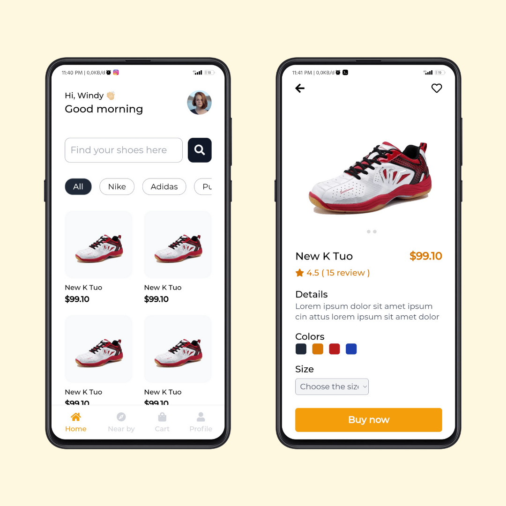

<h3 align="center">Marketplace 1</h3>

Slicing project #06

### About
This is my projects to make UI using front end tech 

Where the ideas and the concept i use from any other designer UI/UX from Instagram or Dribbble

### Original design
by [@shreaygoyal](https://instagram.com/shreaygoyal?utm_medium=copy_link)

### Languages and Tools
- Vue Js 3
- Tailwindcss
- Google Font Montserrat
- FontAwesome
- Termux
- Vite Js
- Acode code editor

### Clone This Repo
- <code>git clone https://github.com/or-abdillh/marketplace-1.git </code>
- <code>cd marketplace-1</code>
- <code>npm install</code>
- <code>npm run dev</code>

### Demo 
- [Marketplace](https://marketplace-1.vercel.app/)

[Oka R Abdillah ](http://github.com/or-abdillh)
 
Last edited on : 12/01/2022